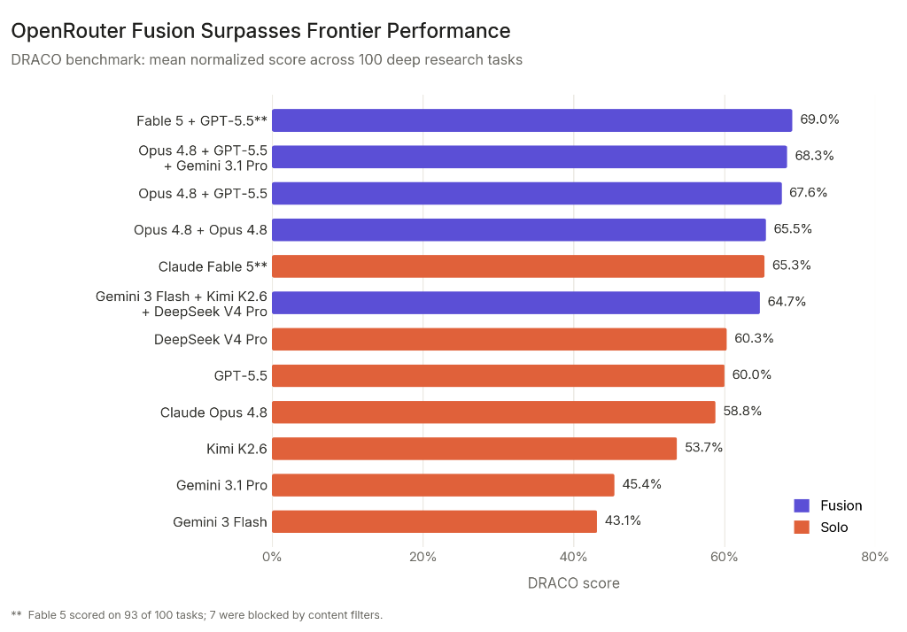

<h1 align="center">gavel</h1>

<p align="center">
  <b>Multi-model fusion for Claude Code.</b><br>
  Ask OpenAI Codex + Google Gemini + the Claude model you're running in parallel, then let Claude
  judge, synthesize one answer, and act on it.
</p>

---

`/gavel:fuse <task>` asks **three** models the same thing: the **Claude Code model you're running**,
**OpenAI Codex**, and **Google Gemini**. Codex and Gemini are **read-only advisors**; Claude is
**panelist #3, the judge, and the actor** — it synthesizes a single fused answer and then **acts on
it**. Only Claude writes to your workspace.

It runs the models through their **local CLIs** (`codex`, `gemini`), reusing your existing logins.
No API keys to wire up, no MCP servers, no background jobs.

## Inspiration

Gavel is inspired by OpenRouter's [**Fusion beats Frontier**](https://openrouter.ai/blog/announcements/fusion-beats-frontier/):
dispatch a prompt to a panel of models, then have a judge synthesize their answers into one response
that beats any single frontier model. Gavel brings that pattern into Claude Code — Codex and Gemini
answer as advisors, and the Claude model you're running is the judge that fuses their views and acts.

<p align="center">
  
</p>

<sub>Benchmark chart from OpenRouter's "Fusion beats Frontier" announcement (© OpenRouter), included for reference and attribution.</sub>

## Install

In Claude Code:

```text
/plugin marketplace add junkim100/gavel
/plugin install gavel@gavel
```

(Reload/restart if prompted.)

**Local development** — clone the repo and point the marketplace at the clone instead:

```text
git clone https://github.com/junkim100/gavel.git
/plugin marketplace add /path/to/gavel    # the cloned directory
/plugin install gavel@gavel
```

## Setup

```text
/gavel:setup
```

Reports whether `codex` and `gemini` are installed, authenticated, and recent enough, and offers to
install whatever is missing. Authentication:

- **Codex** — `!codex login` (install: `npm install -g @openai/codex`).
- **Gemini** — run `!gemini` once to log in (OAuth), or `export GEMINI_API_KEY=…`
  (install: `npm install -g @google/gemini-cli`).

Gavel needs **at least one** advisor usable, but works best with both.

## Commands

| Command | What it does |
| --- | --- |
| `/gavel:fuse <task>` | Ask Claude + Codex + Gemini in parallel, synthesize one fused answer, then act on it. |
| `/gavel:ask <codex\|gemini> <prompt>` | Send a prompt to a single model and show its answer verbatim (no fusing, no edits). |
| `/gavel:setup` | Check/install/auth the Codex and Gemini CLIs. |

## How advisors stay read-only

Only Claude modifies your workspace. The two advisors are constrained differently because their CLIs
differ:

- **Codex** runs in your project under its OS read-only sandbox (`-s read-only`) — a hard boundary: it
  reads your code but cannot change it.
- **Gemini** has no equivalent read-only sandbox (its `plan` mode doesn't stop shell-based writes), so
  gavel runs it **isolated**: in a throwaway directory with `PWD`/`OLDPWD` scrubbed, so it can't
  discover your repo path or make relative writes into it. It answers from the task text — include any
  code Gemini should see directly in your task. Note this is isolation, **not a hardened sandbox**:
  Gemini still inherits `$HOME` and could act on an absolute path you hand it, so don't paste untrusted
  content into a fuse expecting confinement.
- Prompts are passed via a temp file and reach each CLI on **stdin**, never through the shell or
  process arguments (so quotes / `$(...)` / secrets in a task can't inject or leak).

## Configuration

Defaults: Codex `gpt-5.5`, Gemini `gemini-2.5-pro`, per-model timeout `300s`. Override via env vars
(`GAVEL_CODEX_MODEL`, `GAVEL_GEMINI_MODEL`, `GAVEL_TIMEOUT`) or a settings file —
`~/.gavel/config.json` (user) or `./.gavel.json` (project):

```json
{
  "providers": {
    "codex":  { "enabled": true, "model": "gpt-5.5" },
    "gemini": { "enabled": true, "model": "gemini-2.5-pro" }
  },
  "panel": ["codex", "gemini"],
  "timeout": 300
}
```

- Set a provider `"enabled": false` to skip it everywhere with **no repeated warnings**.
- `panel` selects which providers `/gavel:fuse` queries (default: all enabled).

> Gemini model availability depends on your account/tier. If you hit `ModelNotFoundError`, set
> `GAVEL_GEMINI_MODEL` to a model you can access (e.g. `gemini-2.5-flash`).

## Adding another model

`scripts/gavel.mjs` is built around a `PROVIDERS` registry. To add a CLI (e.g. a future `qwen`), add
one entry — its binary, default model, auth check, and a `run()` that invokes it read-only with the
prompt on stdin — and leave it `isolated` (the default) unless it has a real OS read-only sandbox like
Codex. It then appears in `/gavel:setup` and the `/gavel:fuse` panel automatically; to also expose it
via `/gavel:ask`, add its name to the one-line allow-list in `commands/ask.md`. (Providers are
CLI-based today; an API-key-only provider would need a small tweak to the `usable` check.)

## Requirements & versions

`node`, the `codex` CLI (logged in), and the `gemini` CLI (logged in). Tested with **codex ≥ 0.133.0**
and **gemini ≥ 0.46.0**; older versions may lack required flags — `/gavel:setup` warns if your CLI is
older than tested.

## Testing

`bash scripts/smoke-test.sh` runs the deterministic checks (read-only enforcement, prompt
injection-safety, strict exit codes, degraded/disabled readiness). The in-Claude-Code behavior of the
slash commands (`/gavel:fuse` synthesizing then acting) is best verified live in a scratch repo.

## License

MIT — see [LICENSE](./LICENSE).
